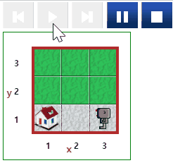
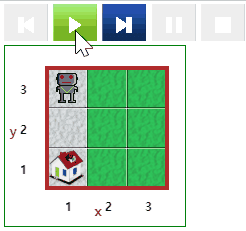
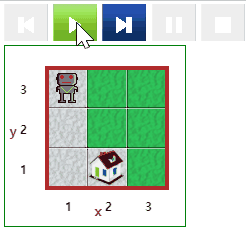
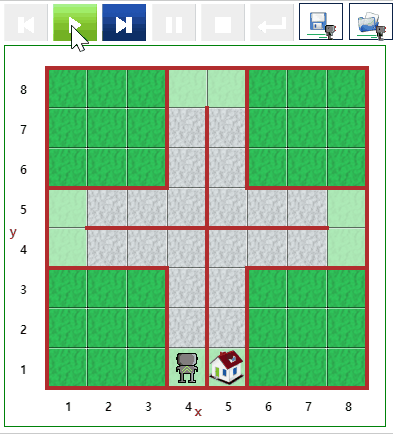

# 집 (Home) {#intro}

## Alone {#alone}

::: {.row}
::: {.col-md-6}
### 실행결과

```{r alone-gif, out.width="70%", fig.align='center'}
if (knitr:::is_latex_output()) {
  knitr::asis_output('\\url{....}')
} else {
  knitr::include_graphics("fig/Alone.gif")
}
```
:::

::: {.col-md-6}
### 코드

```{r alone, echo = TRUE, eval = FALSE}
move()
move()
turn_left()
move()

```
:::
:::

## Home 1 {#home-01}

::: {.row}
::: {.col-md-6}
### 실행결과

```{r home01-gif, out.width="70%", fig.align='center'}
if (knitr:::is_latex_output()) {
  knitr::asis_output('\\url{....}')
} else {
  
}
```
:::

::: {.col-md-6}
### 코드

```{r home01, echo = TRUE, eval = FALSE}
move()
move()

```
:::
:::

## Home 2 {#home-02}

::: {.row}
::: {.col-md-6}
### 실행결과

```{r home02-gif, out.width="70%", fig.align='center'}
if (knitr:::is_latex_output()) {
  knitr::asis_output('\\url{....}')
} else {
  
}
```
:::

::: {.col-md-6}
### 코드

```{r home02, echo = TRUE, eval = FALSE}
move()
move()

```
:::
:::

## Home 3 {#home-03}

::: {.row}
::: {.col-md-6}
### 실행결과

```{r home03-gif, out.width="70%", fig.align='center'}
if (knitr:::is_latex_output()) {
  knitr::asis_output('\\url{....}')
} else {
  
}
```
:::

::: {.col-md-6}
### 코드

```{r home03, echo = TRUE, eval = FALSE}
move()
move()
turn_left()
move()
```
:::
:::


## Home 4 {#home-04}

::: {.row}
::: {.col-md-6}
### 실행결과

```{r home04-gif, out.width="70%", fig.align='center'}
if (knitr:::is_latex_output()) {
  knitr::asis_output('\\url{....}')
} else {
  
}
```
:::

::: {.col-md-6}
### 코드

```{r home04, echo = TRUE, eval = FALSE}
move()
move()
move()
turn_left()
move()
move()
move()
turn_left()
turn_left()
turn_left()
move()
turn_left()
turn_left()
turn_left()
move()
move()
move()
turn_left()
move()
move()
move()
turn_left()
turn_left()
turn_left()
move()
turn_left()
turn_left()
turn_left()
move()
move()
move()
turn_left()
move()
move()
move()
turn_left()
turn_left()
turn_left()
move()
turn_left()
turn_left()
turn_left()
move()
move()
move()
turn_left()
move()
move()
move()
```
:::
:::


