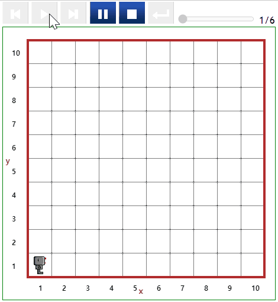

# 집 (Home) {#intro}

윈도우의 경우 `컨트롤+F5` 단축키를 누르게 되면 웹페이지를 열 수 있다. 이를 통해 리보그의 해당 과제을 파악할 수 있고 목적을 명확히 인식하고 문제를 해결해나갈 수 있다.

## Alone {#alone}

- [문제 바로가기](https://reeborg.ca/reeborg.html?lang=ko-en&mode=python&menu=worlds%2Fmenus%2Freeborg_intro_en.json&name=Alone&url=worlds%2Ftutorial_en%2Falone.json)
- '리보그의 키보드'의 각종 명령어 사용법을 익힌다.

::: {.row}
::: {.col-md-6}
### 실행결과

```{r alone-gif, out.width="70%", fig.align='center'}
if (knitr:::is_latex_output()) {
  knitr::asis_output('\\url{....}')
} else {
  
}
```
:::

::: {.col-md-6}
### 코드

```{r alone, echo = TRUE, eval = FALSE}
move()
move()
turn_left()
move()

```
:::
:::

## Home 1 {#home-01}

- [문제 바로가기](https://reeborg.ca/reeborg.html?lang=ko-en&mode=python&menu=worlds%2Fmenus%2Freeborg_intro_en.json&name=Home%201&url=worlds%2Ftutorial_en%2Fhome1.json)
- 리보그가 집을 떠나 있어 집으로 되돌아간다.
    - 로봇의 좌표 (x, y) = (3, 1) 라서 로봇의 최종위치를 반드시 (x, y) = (1, 1) 으로 이동시킨다.

::: {.row}
::: {.col-md-6}
### 실행결과

```{r home01-gif, out.width="70%", fig.align='center'}
if (knitr:::is_latex_output()) {
  knitr::asis_output('\\url{....}')
} else {
  knitr::include_graphics("fig/Home_01.gif")
}
```
:::

::: {.col-md-6}
### 코드

```{r home01, echo = TRUE, eval = FALSE}
move()
move()

```
:::
:::

## Home 2 {#home-02}

- [문제 바로가기](https://reeborg.ca/reeborg.html?lang=ko-en&mode=python&menu=worlds%2Fmenus%2Freeborg_intro_en.json&name=Home%202&url=worlds%2Ftutorial_en%2Fhome2.json)
- 리보그가 집을 떠나 있어 집으로 되돌아간다.
    - 로봇의 좌표 (x, y) = (1, 3) 라서 로봇의 최종위치를 반드시 (x, y) = (1, 1) 으로 이동시킨다.


::: {.row}
::: {.col-md-6}
### 실행결과

```{r home02-gif, out.width="70%", fig.align='center'}
if (knitr:::is_latex_output()) {
  knitr::asis_output('\\url{....}')
} else {
  
}
```
:::

::: {.col-md-6}
### 코드

```{r home02, echo = TRUE, eval = FALSE}
move()
move()

```
:::
:::

## Home 3 {#home-03}

- [문제 바로가기](https://reeborg.ca/reeborg.html?lang=ko-en&mode=python&menu=worlds%2Fmenus%2Freeborg_intro_en.json&name=Home%203&url=worlds%2Ftutorial_en%2Fhome3.json)
- 리보그가 집을 떠나 있어 집으로 되돌아간다.
    - 로봇의 좌표 (x, y) = (1, 3) 라서 로봇의 최종위치를 반드시 (x, y) = (2, 1) 으로 이동시킨다.

::: {.row}
::: {.col-md-6}
### 실행결과

```{r home03-gif, out.width="70%", fig.align='center'}
if (knitr:::is_latex_output()) {
  knitr::asis_output('\\url{....}')
} else {
  knitr::include_graphics("fig/Home_03.gif")
}
```
:::

::: {.col-md-6}
### 코드

```{r home03, echo = TRUE, eval = FALSE}
move()
move()
turn_left()
move()
```
:::
:::


## Home 4 {#home-04}

- [문제 바로가기](https://reeborg.ca/reeborg.html?lang=ko-en&mode=python&menu=worlds%2Fmenus%2Freeborg_intro_en.json&name=Home%204&url=worlds%2Ftutorial_en%2Fhome4.json)
- 리보그가 집을 떠나 있어 집으로 되돌아간다.
    - 로봇의 좌표 (x, y) = (4, 1) 라서 로봇의 최종위치를 반드시 (x, y) = (5, 1) 으로 이동시킨다.

::: {.row}
::: {.col-md-6}
### 실행결과

```{r home04-gif, out.width="70%", fig.align='center'}
if (knitr:::is_latex_output()) {
  knitr::asis_output('\\url{....}')
} else {
  knitr::include_graphics("fig/Home_04.gif")
}
```
:::

::: {.col-md-6}
### 코드

```{r home04, echo = TRUE, eval = FALSE}
move()
move()
move()
turn_left()
move()
move()
move()
turn_left()
turn_left()
turn_left()
move()
turn_left()
turn_left()
turn_left()
move()
move()
move()
turn_left()
move()
move()
move()
turn_left()
turn_left()
turn_left()
move()
turn_left()
turn_left()
turn_left()
move()
move()
move()
turn_left()
move()
move()
move()
turn_left()
turn_left()
turn_left()
move()
turn_left()
turn_left()
turn_left()
move()
move()
move()
turn_left()
move()
move()
move()
```
:::
:::


