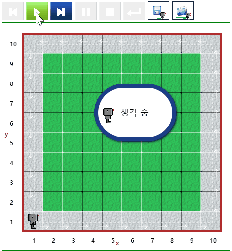
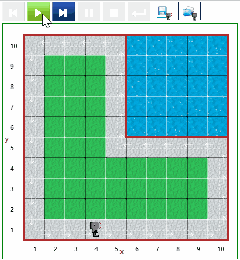

# 돌아다니기 (Around) {#around}

## Around 1 {#around-01}

::: {.row}
::: {.col-md-6}
### 실행결과

```{r around-01-gif, out.width="70%", fig.align='center'}
if (knitr:::is_latex_output()) {
  knitr::asis_output('\\url{....}')
} else {
  
}
```
:::

::: {.col-md-6}
### 코드

```{r around-01, echo = TRUE, eval = FALSE}
repeat 4 :
    repeat 9 :
        move()
    turn_left()

```
:::
:::

## Around 2 {#around-02}

::: {.row}
::: {.col-md-6}
### 실행결과

```{r around-02-gif, out.width="70%", fig.align='center'}
if (knitr:::is_latex_output()) {
  knitr::asis_output('\\url{....}')
} else {
  
}
```
:::

::: {.col-md-6}
### 코드

```{r around-02, echo = TRUE, eval = FALSE}
def turn_right():
    turn_left()
    turn_left()
    turn_left()

while front_is_clear() :
    move()
    if wall_in_front() :
        turn_left()
    if right_is_clear() :
        turn_right()
        
```
:::
:::


## Around 3 {#around-03}

## Around 4 {#around-04}

