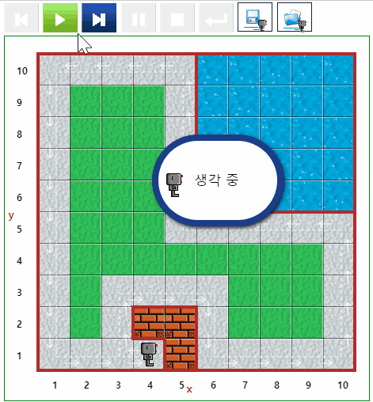

# 돌아다니기 (Around) {#around}

## Around 1 {#around-01}

::: {.row}
::: {.col-md-6}
### 실행결과

```{r around-01-gif, out.width="70%", fig.align='center'}
if (knitr:::is_latex_output()) {
  knitr::asis_output('\\url{....}')
} else {
  
}
```
:::

::: {.col-md-6}
### 코드

```{python around-01, echo = TRUE, eval = FALSE}
repeat 4 :
    repeat 9 :
        move()
    turn_left()

```
:::
:::

## Around 2 {#around-02}

리보그가 토큰(token)을 가지고 다니는 점을 이용하여 리보그 세상을 한바퀴 삥 둘러 돌아다닌 후에 제자리로 돌아온 위치를 표식하고 이를 프로그램 종료 조건으로 설정한다.

::: {.row}
::: {.col-md-6}
### 실행결과

```{r around-02-gif, out.width="70%", fig.align='center'}
if (knitr:::is_latex_output()) {
  knitr::asis_output('\\url{....}')
} else {
  
}
```
:::

::: {.col-md-6}
### 코드

```{python around-02, echo = TRUE, eval = FALSE}
def turn_right():
    turn_left()
    turn_left()
    turn_left()

# 목표지점 표식    
def drop_token():
    put("token")

drop_token()
move()

while not object_here():
    move()
    if wall_in_front() :
        turn_left()
    if right_is_clear() :
        turn_right()
        move()
        
        
```
:::
:::


## Around 3 {#around-03}

[Around 2](#around-02)와 마찬가지로 토큰을 떨어뜨려 표식을 하고 자리를 한칸 이동한 후에 돌아다니는 작업을 수행한다.

::: {.row}
::: {.col-md-6}
### 실행결과

```{r around-03-gif, out.width="70%", fig.align='center'}
if (knitr:::is_latex_output()) {
  knitr::asis_output('\\url{....}')
} else {
  knitr::include_graphics("fig/Around_03.gif")
}
```
:::

::: {.col-md-6}
### 코드

```{python around-03, echo = TRUE, eval = FALSE}
def turn_right():
    turn_left()
    turn_left()
    turn_left()

# 목표지점 표식    
def drop_token():
    put("token")

drop_token()
turn_left()
move()

while not object_here():
    if right_is_clear():
        turn_right()
        move()
    elif front_is_clear():
        move()
    else:
        turn_left()

```
:::
:::


## Around 4 {#around-04}


::: {.row}
::: {.col-md-6}
### 실행결과

```{r around-04-gif, out.width="70%", fig.align='center'}
if (knitr:::is_latex_output()) {
  knitr::asis_output('\\url{....}')
} else {
  
}
```
:::

::: {.col-md-6}
### 코드

```{python around-04, echo = TRUE, eval = FALSE}
def turn_right():
    turn_left()
    turn_left()
    turn_left()

def turn_around():
    turn_left()
    turn_left()
    
    
# 목표지점 표식    
def drop_token():
    put("token")

drop_token()
turn_around()
move()

while not object_here():
    if right_is_clear():
        turn_right()
        move()
    elif front_is_clear():
        move()
    else:
        turn_left()

```
:::
:::
