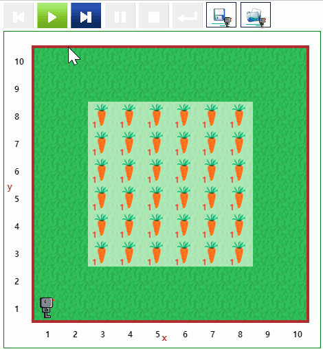
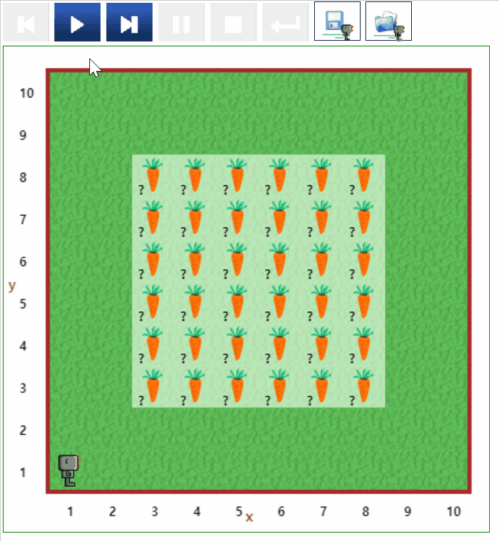
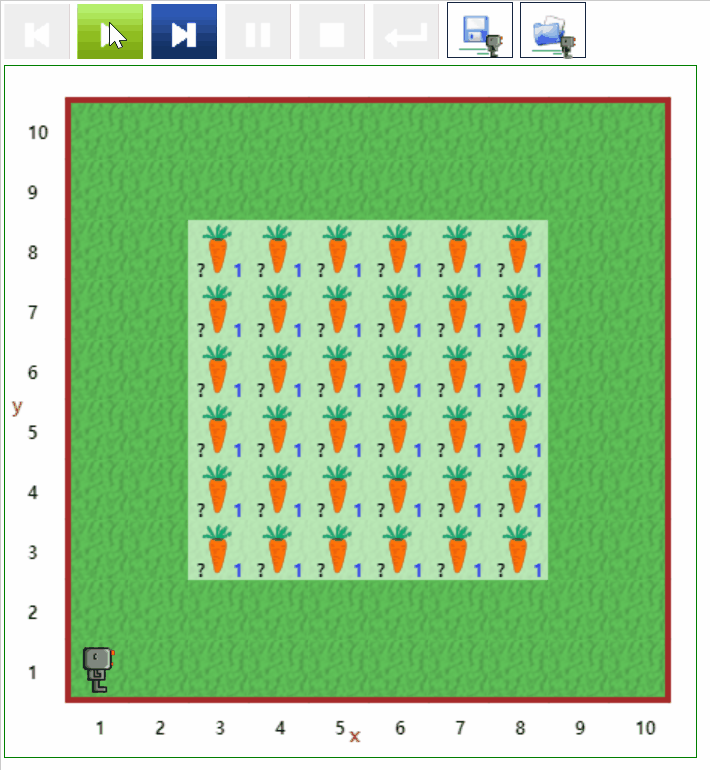

# 추수 (Harvest) {#harvest}

## 추수 1 {#harvest-01}

- [문제 바로가기](https://reeborg.ca/reeborg.html?lang=ko-en&mode=python&menu=worlds%2Fmenus%2Freeborg_intro_en.json&name=Harvest%201&url=worlds%2Ftutorial_en%2Fharvest1.json)
- 선행 지식
    - 기본 함수 : `move()`, `turn_left()`, `take()`
    - 테스트 함수 : `object_here()`
    - 반복: `while` 혹은 `if` 과 결함
- 힌트: `harvest_one_row()` 함수를 작성하고 6번 반복
- 난이도: 3
- 참고: [리보그 세상 - 추가된 추수 도전과제](https://reeborg.ca/docs/ko/variables/harvest3.html)


::: {.row}
::: {.col-md-6}
### 실행결과

```{r harvest-01-gif, out.width="70%", fig.align='center'}
if (knitr:::is_latex_output()) {
  knitr::asis_output('\\url{....}')
} else {
  
}
```
:::

::: {.col-md-6}
### 코드

```{r harvest-01, echo = TRUE, eval = FALSE}
# 추수 위치로 이동 ----
def turn_right():
    turn_left()
    turn_left()
    turn_left()
    
def ready_harvest():
    move()
    turn_left()
    move()
    move()
    turn_right()
  
ready_harvest()

# 한줄 추수 ----
def harvest_one_row():
    if not object_here():
        move()
    while object_here():
        if object_here():
            take()
        move()
          
# harvest_one_row()

# 다음 추수 위치로 이동
def turn_around():
    turn_left()
    turn_left()

def move_to_next_row():    
    turn_around()
    repeat 7:
        move()
    turn_right()
    move()
    turn_right()
    
# move_to_next_row()

# 전체 6줄 추수

repeat 6:
    harvest_one_row()
    move_to_next_row()
    
```
:::
:::

## 추수 2 {#harvest-02}

- [문제 바로가기](https://reeborg.ca/reeborg.html?lang=ko-en&mode=python&menu=worlds%2Fmenus%2Freeborg_intro_en.json&name=Harvest%202&url=worlds%2Ftutorial_en%2Fharvest2.json)
- 선행 지식
    - 기본 함수 : `move()`, `turn_left()`, `take()`
    - 테스트 함수 : `object_here()`
    - 반복: `while` 혹은 `if` 과 결함
- 힌트: `harvest_one_row()` 함수를 작성하고 6번 반복
- 난이도: 4
- 참고: [리보그 세상 - 추가된 추수 도전과제](https://reeborg.ca/docs/ko/variables/harvest3.html)


::: {.row}
::: {.col-md-6}
### 실행결과

```{r harvest-02-gif, out.width="70%", fig.align='center'}
if (knitr:::is_latex_output()) {
  knitr::asis_output('\\url{....}')
} else {
  
}
```
:::

::: {.col-md-6}
### 코드

```{r harvest-02, echo = TRUE, eval = FALSE}
# 추수 위치로 이동 ----
def turn_right():
    turn_left()
    turn_left()
    turn_left()
    
def ready_harvest():
    move()
    turn_left()
    move()
    move()
    turn_right()
  
ready_harvest()

# 한줄 추수 ----
def harvest_one_row():
    repeat 6:
        if not object_here():
            move()
        while object_here():
            take()

# 다음 추수 위치로 이동
def turn_around():
    turn_left()
    turn_left()

def move_to_next_row():    
    turn_around()
    repeat 6:
        move()
    turn_right()
    move()
    turn_right()

# 전체 6줄 추수

repeat 6:
    harvest_one_row()
    move_to_next_row()
    
```
:::
:::


## 추수 3 {#harvest-03}

- [문제 바로가기](https://reeborg.ca/reeborg.html?lang=ko-en&mode=python&menu=worlds%2Fmenus%2Freeborg_intro_en.json&name=Harvest%203&url=worlds%2Ftutorial_en%2Fharvest3.json)
- 선행 지식
    - 기본 함수 : `move()`, `turn_left()`, `take()`
    - 테스트 함수 : `object_here()`
    - 반복: `while` 혹은 `if` 과 결함
- 힌트: `harvest_one_row()` 함수를 작성하고 6번 반복
- 난이도: 4
- 참고: [리보그 세상 - 추가된 추수 도전과제](https://reeborg.ca/docs/ko/variables/harvest3.html)


::: {.row}
::: {.col-md-6}
### 실행결과

```{r harvest-03-gif, out.width="70%", fig.align='center'}
if (knitr:::is_latex_output()) {
  knitr::asis_output('\\url{....}')
} else {
  
}
```
:::

::: {.col-md-6}
### 코드

```{r harvest-03, echo = TRUE, eval = FALSE}
# 추수 위치로 이동 ----
def turn_right():
    turn_left()
    turn_left()
    turn_left()
    
def ready_harvest():
    move()
    move()
    turn_left()
    move()
    move()
    turn_right()
  
ready_harvest()

# 당근 심기 ----
def fix_one_row():
    repeat 6:
        while not object_here():
            put()
        # 당근 1개 이상인 경우 다 뽑아내고 1개 심는다.            
        if object_here():
            while object_here():
                take()
            put()
            move()

# 다음 추수 위치로 이동
def turn_around():
    turn_left()
    turn_left()

def move_to_next_row():    
    turn_around()
    repeat 6:
        move()
    turn_right()
    move()
    turn_right()

# 전체 6줄 추수

repeat 6:
    fix_one_row()
    move_to_next_row()


```
:::
:::
