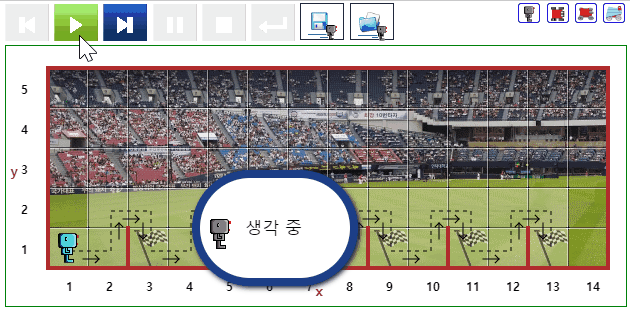
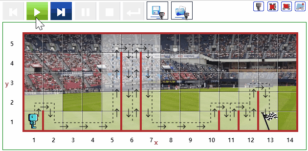

# 장애물 넘기 {#hurdle}

## 장애물 1 {#hurdle-01}

- [문제 바로가기](https://reeborg.ca/reeborg.html?lang=ko-en&mode=python&menu=worlds%2Fmenus%2Freeborg_intro_en.json&name=Hurdle%201&url=worlds%2Ftutorial_en%2Fhurdle1.json)
- 선행 지식
    - 기본 함수 : `move()`, `turn_left()`
- 힌트: `jump()` 함수를 작성해서 프로그램 코드를 단순화시킬 수 있다.
- 난이도: 2
- 참고: [리보그 세상 - 추가된 추수 도전과제](https://reeborg.ca/docs/ko/variables/harvest3.html)


::: {.row}
::: {.col-md-6}
### 실행결과

```{r hurdle-01-gif, out.width="70%", fig.align='center'}
if (knitr:::is_latex_output()) {
  knitr::asis_output('\\url{....}')
} else {
  knitr::include_graphics("fig/Hurdle_01.gif")
}
```
:::

::: {.col-md-6}
### 코드

```{r hurdle-01, echo = TRUE, eval = FALSE}
def turn_right():
    turn_left()
    turn_left()
    turn_left()

def jump_over_hurdle():    
    move()
    turn_left()
    move()
    turn_right()
    move()
    turn_right()
    move()
    turn_left()

# jump_over_hurdle()    

repeat 6:
   jump_over_hurdle()

```
:::
:::

## 장애물 2 {#hurdle-02}

- [문제 바로가기](https://reeborg.ca/reeborg.html?lang=ko-en&mode=python&menu=worlds%2Fmenus%2Freeborg_intro_en.json&name=Hurdle%202&url=worlds%2Ftutorial_en%2Fhurdle2.json)
- 선행 지식
    - 기본 함수 : `move()`, `turn_left()`
    - 조건 / 테스트 : `at_goal()` 혹은 부정(negation)
    - 반복: `while()`
- 난이도: 3


::: {.row}
::: {.col-md-6}
### 실행결과

```{r hurdle-02-gif, out.width="70%", fig.align='center'}
if (knitr:::is_latex_output()) {
  knitr::asis_output('\\url{....}')
} else {
  
}
```
:::

::: {.col-md-6}
### 코드

```{r hurdle-02, echo = TRUE, eval = FALSE}
def turn_right():
    turn_left()
    turn_left()
    turn_left()

def jump_over_hurdle():    
    move()
    turn_left()
    move()
    turn_right()
    move()
    turn_right()
    move()
    turn_left()

# jump_over_hurdle()    

while not at_goal():
    jump_over_hurdle()
        
```
:::
:::

## 장애물 3 {#hurdle-03}

- [문제 바로가기](https://reeborg.ca/reeborg.html?lang=ko-en&mode=python&menu=worlds%2Fmenus%2Freeborg_intro_en.json&name=Hurdle%203&url=worlds%2Ftutorial_en%2Fhurdle3.json)
- 선행 지식
    - 기본 함수 : `move()`, `turn_left()`
    - 조건 / 테스트 : `at_goal()`, `front_is_clear()`, `wall_in_front()`, 혹은 부정(negation)
    - 반복과 제어: `while()` 루프와 `if` 문
- 난이도: 4


::: {.row}
::: {.col-md-6}
### 실행결과

```{r hurdle-03-gif, out.width="70%", fig.align='center'}
if (knitr:::is_latex_output()) {
  knitr::asis_output('\\url{....}')
} else {
  knitr::include_graphics("fig/Hurdle_03.gif")
}
```
:::

::: {.col-md-6}
### 코드

```{r hurdle-03, echo = TRUE, eval = FALSE}
def turn_right():
    turn_left()
    turn_left()
    turn_left()

def jump_over_hurdle():
    # move() <-- 일반화를 위해 제거
    turn_left()
    move()
    turn_right()
    move()
    turn_right()
    move()
    turn_left()

# jump_over_hurdle()    

while not at_goal():
    if front_is_clear():
        move()
    elif wall_in_front():
        jump_over_hurdle()
    
```
:::
:::


## 장애물 4 {#hurdle-04}

- [문제 바로가기](https://reeborg.ca/reeborg.html?lang=ko-en&mode=python&menu=worlds%2Fmenus%2Freeborg_intro_en.json&name=Hurdle%204&url=worlds%2Ftutorial_en%2Fhurdle4.json)
- 선행 지식
    - 기본 함수 : `move()`, `turn_left()`
    - 조건 / 테스트 : `at_goal()`, `front_is_clear()`, `wall_in_front()`, 혹은 부정(negation)
    - 반복과 제어: `while()` 루프와 `if` 문
- 난이도: 4.5
- 장애물 4 프로그램은 장애물 1, 2, 3 프로그램도 정상 동작시킬 수 있어야 한다. 


::: {.row}
::: {.col-md-6}
### 실행결과

```{r hurdle-04-gif, out.width="70%", fig.align='center'}
if (knitr:::is_latex_output()) {
  knitr::asis_output('\\url{....}')
} else {
  
}
```
:::

::: {.col-md-6}
### 코드

```{r hurdle-04, echo = TRUE, eval = FALSE}
def turn_right():
    turn_left()
    turn_left()
    turn_left()

def jump_over_hurdles():
    # 장애물 위쪽 올라가기
    if wall_in_front():
        turn_left()
        while not right_is_clear():
            move()
    # 장애물 위를 넘어가기            
    turn_right()
    move()
    turn_right()
    # 장애물 내려오기
    while front_is_clear():
        move()
    # 다시 경주자세로 자세 갖추기
    turn_left()

while not at_goal():
    if front_is_clear():
        move()
    elif wall_in_front():
        jump_over_hurdles()

```
:::
:::
