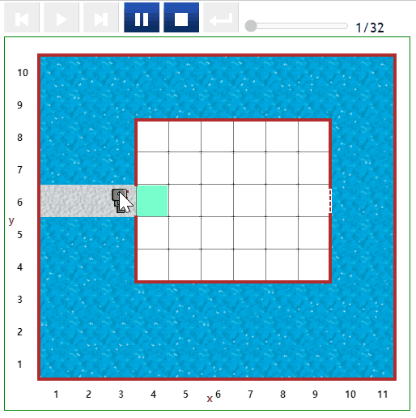
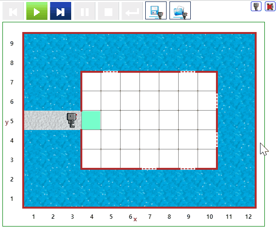
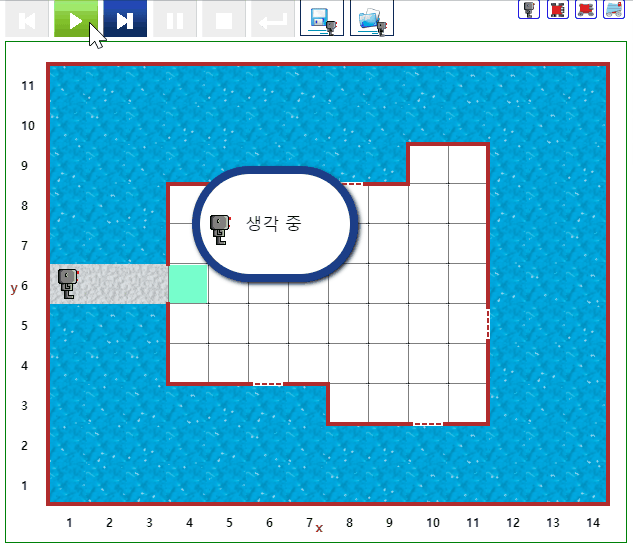

# 비바람 창문 닫기 {#rain}

## 창문 닫기 1 {#rain-01}

- [문제 바로가기](https://reeborg.ca/reeborg.html?lang=ko-en&mode=python&menu=worlds%2Fmenus%2Freeborg_intro_en.json&name=Rain%200&url=worlds%2Ftutorial_en%2Frain0.json)
- 선행 지식
    - 기본 함수 : `move()`, `turn_left()`, `build_wall()`
- 난이도: 1
- 참고: [러플 - 비가 와요](http://statkclee.github.io/rur-ple/intro/22-rain.htm)


::: {.row}
::: {.col-md-6}
### 실행결과

```{r rain-01-gif, out.width="70%", fig.align='center'}
if (knitr:::is_latex_output()) {
  knitr::asis_output('\\url{....}')
} else {
  
}
```
:::

::: {.col-md-6}
### 코드

```{r rain-01, echo = TRUE, eval = FALSE}
def turn_around():
    turn_left()    
    turn_left()

def close_window():
    repeat 6:
        move()
    build_wall()    

def go_to_home():
    turn_around()    
    repeat 5:
        move()

close_window()        
go_to_home()

```
:::
:::

## 창문 닫기 2 {#rain-02}

- [문제 바로가기](https://reeborg.ca/reeborg.html?lang=ko-en&mode=python&menu=worlds%2Fmenus%2Freeborg_intro_en.json&name=Rain%201&url=worlds%2Ftutorial_en%2Frain1.json)
- 선행 지식
    - 기본 함수 : `move()`, `turn_left()`, `build_wall()`
    - 테스트 조건: `right_is_clear()`, `wall_on_right()`, `at_goal()`
    - 반복 및 제어: `while` 루프, `if` 문
- 난이도: 5
- 참고: [러플 - 비가 와요](http://statkclee.github.io/rur-ple/intro/22-rain.htm)


::: {.row}
::: {.col-md-6}
### 실행결과

```{r rain-02-gif, out.width="70%", fig.align='center'}
if (knitr:::is_latex_output()) {
  knitr::asis_output('\\url{....}')
} else {
  
}
```
:::

::: {.col-md-6}
### 코드

```{r rain-02, echo = TRUE, eval = FALSE}
def turn_right():
    turn_left()
    turn_left()
    turn_left()

    
def move_to_goal():
    move()
    turn_right()

move_to_goal()
move() 

while not at_goal():
    if front_is_clear():
        move()
    if wall_in_front():
        turn_left()
    if right_is_clear():
        turn_right()
        build_wall()
        turn_left()
    

```
:::
:::


## 창문 닫기 3 {#rain-03}

- [문제 바로가기](https://reeborg.ca/reeborg.html?lang=ko-en&mode=python&menu=worlds%2Fmenus%2Freeborg_intro_en.json&name=Rain%202&url=worlds%2Ftutorial_en%2Frain2.json)
- 선행 지식
    - 기본 함수 : `move()`, `turn_left()`, `build_wall()`
    - 테스트 조건: `right_is_clear()`, `wall_on_right()`, `at_goal()`
    - 반복 및 제어: `while` 루프, `if` 문
- 힌트: 우회전할지 창문을 닫을지 리보그를 한번더 이동시키면 2가지 경우가 존재한다.
- 난이도: 8
- 참고: [러플 - 비가 와요](http://statkclee.github.io/rur-ple/intro/22-rain.htm)


::: {.row}
::: {.col-md-6}
### 실행결과

```{r rain-03-gif, out.width="70%", fig.align='center'}
if (knitr:::is_latex_output()) {
  knitr::asis_output('\\url{....}')
} else {
  
}
```
:::

::: {.col-md-6}
### 코드

```{r rain-03, echo = TRUE, eval = FALSE}
def turn_right():
    turn_left()
    turn_left()
    turn_left()
    
def move_to_goal():
    repeat 3:
        move()
    turn_right()

move_to_goal()
move() 

def go_back():
    turn_left()
    turn_left()
    move()
    turn_left()
    turn_left()
    
def close_window():
    turn_right()
    build_wall()
    turn_left()

while not at_goal():
    if wall_in_front():
        turn_left()
    if front_is_clear() and right_is_clear():    
        move()
        if right_is_clear():
            go_back()
            turn_right()
        elif not right_is_clear():    
            go_back()            
            close_window()
    move()
    
```
:::
:::
