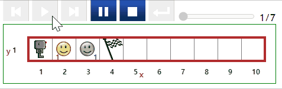
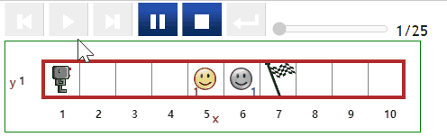
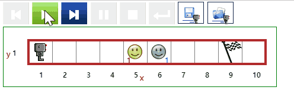
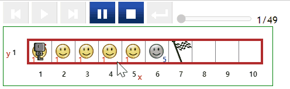
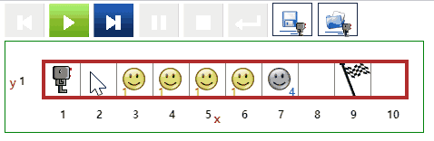

# 토큰 {#rain}

## 토큰 이동 1 {#token-01}

- [문제 바로가기](https://reeborg.ca/reeborg.html?lang=ko-en&mode=python&menu=worlds%2Fmenus%2Freeborg_intro_en.json&name=Tokens%201&url=worlds%2Ftutorial_en%2Ftokens1.json)
- 선행 지식
    - 기본 함수 : `move()`, `put()`, `take()`
- 난이도: 1


::: {.row}
::: {.col-md-6}
### 실행결과

```{r token-01-gif, out.width="70%", fig.align='center'}
if (knitr:::is_latex_output()) {
  knitr::asis_output('\\url{....}')
} else {
  
}
```
:::

::: {.col-md-6}
### 코드

```{python token-01, echo = TRUE, eval = FALSE}
move()
take()
move()
put()
move()

```
:::
:::


## 토큰 이동 2 {#token-02}

- [문제 바로가기](https://reeborg.ca/reeborg.html?lang=ko-en&mode=python&menu=worlds%2Fmenus%2Freeborg_intro_en.json&name=Tokens%202&url=worlds%2Ftutorial_en%2Ftokens2.json)
- 선행 지식
    - 기본 함수 : `move()`, `put()`, `take()`
- 난이도: 1
- `move_until_done()` 함수를 제작해서 `if`문을 사용하게 되면 조금더 깔끔하게 목적을 달성할 수 있다.

::: {.row}
::: {.col-md-6}
### 실행결과

```{r token-02-gif, out.width="70%", fig.align='center'}
if (knitr:::is_latex_output()) {
  knitr::asis_output('\\url{....}')
} else {
  
}
```
:::

::: {.col-md-6}
### 코드

```{python token-02, echo = TRUE, eval = FALSE}
def move_until_done():
    move()
    if object_here():
        take()
        move()
        put()
        
repeat 5:
    move_until_done()

```
:::
:::


## 토큰 이동 3 {#token-03}

- [문제 바로가기](https://reeborg.ca/reeborg.html?lang=ko-en&mode=python&menu=worlds%2Fmenus%2Freeborg_intro_en.json&name=Tokens%203&url=worlds%2Ftutorial_en%2Ftokens3.json)
- 선행 지식
    - 기본 함수 : `move()`, `put()`, `take()`
    - 테스트 조건: `object_here()`, `at_goal()`
    - 반복과 제어조건: `while` 루프와 부정(negation)
- 난이도: 3

::: {.row}
::: {.col-md-6}
### 실행결과

```{r token-03-gif, out.width="70%", fig.align='center'}
if (knitr:::is_latex_output()) {
  knitr::asis_output('\\url{....}')
} else {
  
}
```
:::

::: {.col-md-6}
### 코드

```{python token-03, echo = TRUE, eval = FALSE}
def move_until_done():
    move()
    if object_here():
        take()
        move()
        put()
        
while not at_goal():
    move_until_done()

```
:::
:::

## 토큰 이동 4 {#token-04}

- [문제 바로가기](https://reeborg.ca/reeborg.html?lang=ko-en&mode=python&menu=worlds%2Fmenus%2Freeborg_intro_en.json&name=Tokens%204&url=worlds%2Ftutorial_en%2Ftokens4.json)
- 선행 지식
    - 기본 함수 : `move()`, `put()`, `take()`
    - 테스트 조건: `object_here()`, `carries_object()`, `at_goal()`
    - 반복과 제어조건: `while` 루프, `if` 문과 부정(negation)
- 난이도: 5

::: {.row}
::: {.col-md-6}
### 실행결과

```{r token-04-gif, out.width="70%", fig.align='center'}
if (knitr:::is_latex_output()) {
  knitr::asis_output('\\url{....}')
} else {
  
}
```
:::

::: {.col-md-6}
### 코드

```{python token-04, echo = TRUE, eval = FALSE}
def collect_all():
    if object_here():
        take()
    move()

def put_down_all_and_move():
    while carries_object():
        put()
    move()
    
while not at_goal():
    if object_here():
        collect_all()
    elif carries_object():
        put_down_all_and_move()  
    else:
        move()

```
:::
:::

## 토큰 이동 5 {#token-05}

[토큰 이동 5](#token-04)를 일반화하여 토큰이 있는 곳과 그렇지 않는 곳도 리보그가 이동하여 목적을 달성할 수 있도록 한다.

- [문제 바로가기](https://reeborg.ca/reeborg.html?lang=ko-en&mode=python&menu=worlds%2Fmenus%2Freeborg_intro_en.json&name=Tokens%205&url=worlds%2Ftutorial_en%2Ftokens5.json)
- 선행 지식
    - 기본 함수 : `move()`, `put()`, `take()`
    - 테스트 조건: `object_here()`, `carries_object()`, `at_goal()`
    - 반복과 제어조건: `while` 루프, `if` 문과 부정(negation)
- 난이도: 5

::: {.row}
::: {.col-md-6}
### 실행결과

```{r token-05-gif, out.width="70%", fig.align='center'}
if (knitr:::is_latex_output()) {
  knitr::asis_output('\\url{....}')
} else {
  
}
```
:::

::: {.col-md-6}
### 코드

```{python token-05, echo = TRUE, eval = FALSE}
def collect_all():
    if object_here():
        take()
    move()

def put_down_all_and_move():
    while carries_object():
        put()
    move()
    
while not at_goal():
    if object_here():
        collect_all()
    elif carries_object():
        put_down_all_and_move()  
    else:
        move()

```
:::
:::
