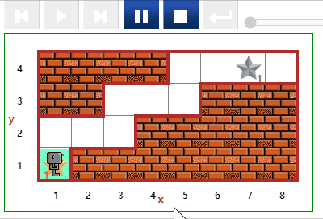
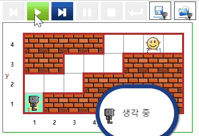

# 신문배달 {#newspaper}

## 신문배달 1 {#newspaper-01}

- [문제 바로가기](https://reeborg.ca/reeborg.html?lang=ko-en&mode=python&menu=worlds%2Fmenus%2Freeborg_intro_en.json&name=Newspaper%200&url=worlds%2Ftutorial_en%2Fnewspaper0.json)
- 선행 지식
    - 기본 함수 : `move()`, `turn_left()`, `take()`, `put()`
- 난이도: 1


::: {.row}
::: {.col-md-6}
### 실행결과

```{r newspaper-01-gif, out.width="70%", fig.align='center'}
if (knitr:::is_latex_output()) {
  knitr::asis_output('\\url{....}')
} else {
  
}
```
:::

::: {.col-md-6}
### 코드

```{python newspaper-01, echo = TRUE, eval = FALSE}
def turn_right():
    turn_left()
    turn_left()
    turn_left()

# 계단 올라가기 ----    
take()
turn_left()
move()
turn_right()

move()
move()

turn_left()
move()
turn_right()

move()
move()

turn_left()
move()
turn_right()

move()
move()
put()

# 계단 내려오기 ----
turn_left()
turn_left()
move()
move()
turn_left()
move()

turn_right()
move()
move()

turn_left()
move()
turn_right()

move()
move()

turn_left()
move()


```
:::
:::


## 신문배달 2 {#newspaper-02}

- [문제 바로가기](https://reeborg.ca/reeborg.html?lang=ko-en&mode=python&menu=worlds%2Fmenus%2Freeborg_intro_en.json&name=Newspaper%200&url=worlds%2Ftutorial_en%2Fnewspaper0.json)
- 선행 지식
    - 기본 함수 : `move()`, `turn_left()`, `take()`, `put()`
- 난이도: 3
- 힌트: `up_three_steps()`, `down_three_steps()`, `turn_around()` 함수를 제작하여 MS. Ada Lovelace에게 전달되는 신문업무를 모듈화시키고 `take("token")` 함수를 호출하여 댓가를 선물로 받아 집으로 돌아온다.

::: {.row}
::: {.col-md-6}
### 실행결과

```{r newspaper-02-gif, out.width="70%", fig.align='center'}
if (knitr:::is_latex_output()) {
  knitr::asis_output('\\url{....}')
} else {
  
}
```
:::

::: {.col-md-6}
### 코드

```{python newspaper-02, echo = TRUE, eval = FALSE}
def turn_right():
    turn_left()
    turn_left()
    turn_left()

def turn_around():
    turn_left()
    turn_left()

def up_three_steps():
    repeat 3:
        turn_left()
        move()
        turn_right()
        move()
        move()

def down_three_steps():
    repeat 3:
        move()
        move()
        turn_left()
        move()
        turn_right()

# 신문 배달 시작
take()
# 계단 올라가서 러브레이스 도착
up_three_steps()
# 신문 높고 토큰 받기
put()
while object_here("token"):
    take("token")
# 되돌아 집에 오기    
turn_around()
down_three_steps()

```
:::
:::


