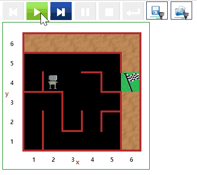

# 미로 탈출 {#maze}

- [문제 바로가기](https://reeborg.ca/reeborg.html?lang=ko-en&mode=python&menu=worlds%2Fmenus%2Freeborg_intro_en.json&name=Maze&url=worlds%2Ftutorial_en%2Fmaze1.json)
- 선행 지식
    - 기본 함수 : `move()`, `turn_left()`
    - 테스트 조건: `front_is_clear()`, `wall_in_front()`, `right_is_clear()`, `wall_on_right()`, `at_goal()`
    - 반복 `while` 루프, `if`/`elif`/`else` 조건 문
- 난이도: 4


::: {.row}
::: {.col-md-6}
### 실행결과

```{r maze-gif, out.width="70%", fig.align='center'}
if (knitr:::is_latex_output()) {
  knitr::asis_output('\\url{....}')
} else {
  
}
```
:::

::: {.col-md-6}
### 코드

```{python maze-01, echo = TRUE, eval = FALSE}
def turn_right():
    turn_left()
    turn_left()
    turn_left()
    
while not at_goal():

    if right_is_clear():
        turn_right()
        move()
    elif front_is_clear():
        move()
    else:
        turn_left()    
```
:::
:::

