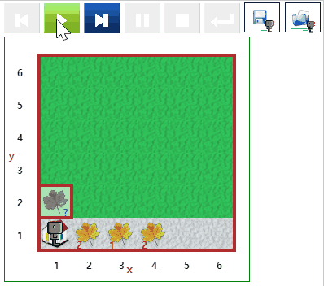
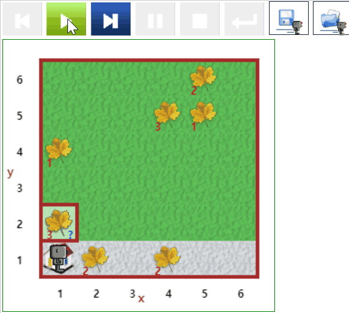

# 폭풍 후에 ... {#storm}

## 낙엽 청소 1 {#storm-01}

- [문제 바로가기](https://reeborg.ca/reeborg.html?lang=ko-en&mode=python&menu=worlds%2Fmenus%2Freeborg_intro_en.json&name=Storm%201&url=worlds%2Ftutorial_en%2Fstorm1.json)
- 선행 지식
    - 기본 함수 : `move()`, `turn_left()`, `take()`, `toss()`
    - 테스트 조건: `object_here()`, `carries_object()`, `front_is_clear()`, `wall_in_front()`
    - 반복 `while`문과 제어 조건 `if` 문을 사용
- 난이도: 4


::: {.row}
::: {.col-md-6}
### 실행결과

```{r storm-01-gif, out.width="70%", fig.align='center'}
if (knitr:::is_latex_output()) {
  knitr::asis_output('\\url{....}')
} else {
  
}
```
:::

::: {.col-md-6}
### 코드

```{python strom-01, echo = TRUE, eval = FALSE}
def turn_right():
    turn_left()
    turn_left()
    turn_left()

def turn_around():
    turn_left()
    turn_left()
    
while front_is_clear():
    move()
    while object_here():
        take()

turn_around()
repeat 5:
    move()

turn_right()    
    
while carries_object():
    toss() 

```
:::
:::


## 낙엽 청소 2 {#storm-02}

- [문제 바로가기](https://reeborg.ca/reeborg.html?lang=ko-en&mode=python&menu=worlds%2Fmenus%2Freeborg_intro_en.json&name=Storm%201&url=worlds%2Ftutorial_en%2Fstorm1.json)
- 선행 지식
    - 기본 함수 : `move()`, `turn_left()`, `take()`, `toss()`
    - 테스트 조건: `object_here()`, `carries_object()`, `front_is_clear()`, `wall_in_front()`
    - 반복 `while`문과 제어 조건 `if` 문을 사용
- 난이도: 4


::: {.row}
::: {.col-md-6}
### 실행결과

```{r storm-02-gif, out.width="70%", fig.align='center'}
if (knitr:::is_latex_output()) {
  knitr::asis_output('\\url{....}')
} else {
  
}
```
:::

::: {.col-md-6}
### 코드

```{python strom-02, echo = TRUE, eval = FALSE}
def turn_around():
    turn_left()
    turn_left()

def turn_right():
    turn_left()
    turn_left()
    turn_left()

def collect_leaves():
    while front_is_clear():
        while object_here():
            take()
        move()
        
def first_collect_leaves():
    while front_is_clear():
        while object_here():
            take()
        move()            
    turn_around()
    repeat 4:
        move()
    turn_right()
    move()
    turn_right()
    collect_leaves()
    turn_left()
    move()
    turn_left()
            
def go_to_beginning():
    while object_here():
        take()    
    turn_around()
    while not wall_in_front():
        move()
    turn_left()
    move()
    turn_left()    

def go_to_home():
    while not wall_in_front():
        move()
        while object_here():
            take()
    turn_left()
    while not at_goal():
        if front_is_clear():
            move()
        elif right_is_clear():
            turn_right()
        elif wall_in_front():
           turn_left()
    turn_right()
    while carries_object():
        toss()
        
move()    
first_collect_leaves()
repeat 3:
    collect_leaves()
    go_to_beginning()


go_to_home()


```
:::
:::


