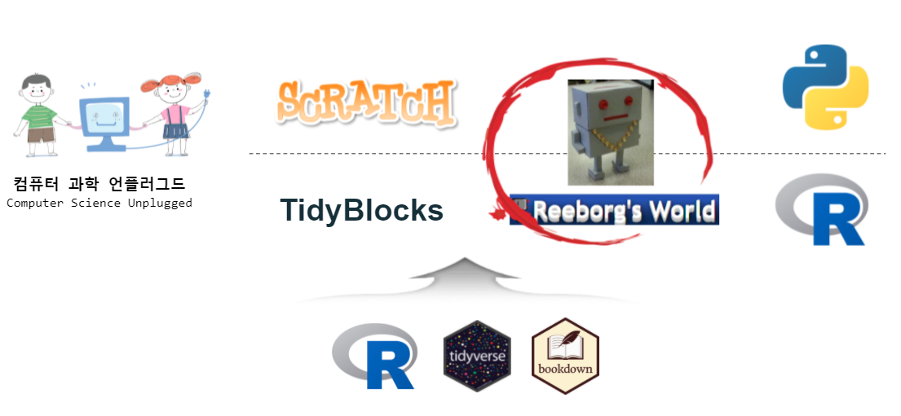
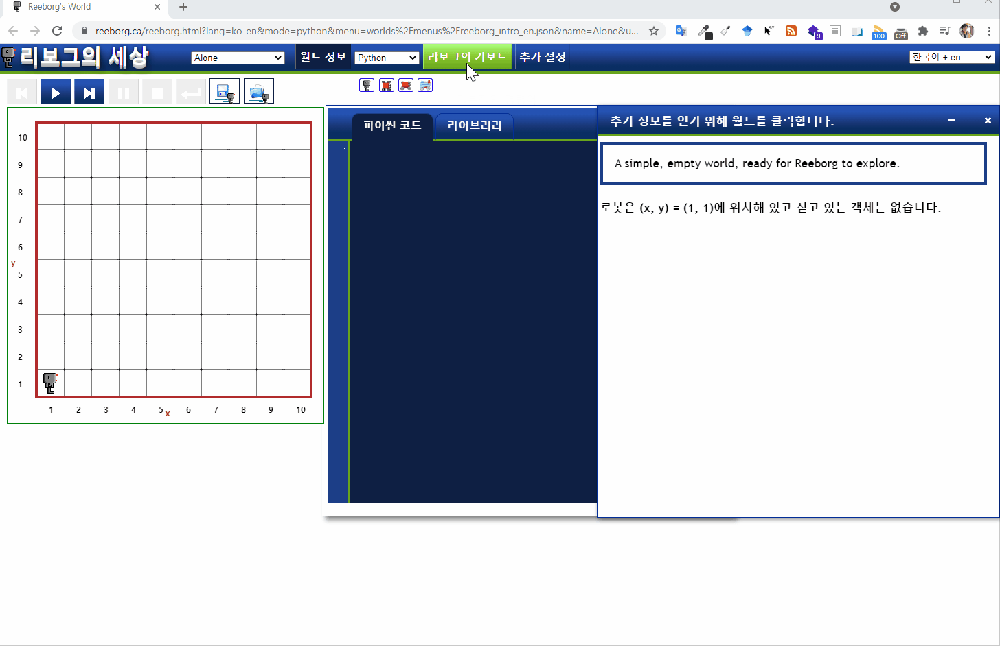

```{r setup, eval=TRUE, include=FALSE}
# install.packages("bookdown")

# automatically create a bib database for R packages
knitr::write_bib(c(
  .packages(), 'bookdown', 'knitr', 'rmarkdown'
), 'packages.bib')

knitr::opts_chunk$set(global.device = TRUE,
                      echo = FALSE, message=FALSE, warning=FALSE,
                      comment="", digits = 3, tidy = FALSE, prompt = FALSE, fig.align = 'center')
```

# 리보그 세상 {#reeborg .unnumbered}

리보그 세상(Reeborg's World)는 [컴퓨터 과학 언플러그드](https://statkclee.github.io/unplugged/)를 통해 전혀 컴퓨터가 없는 상태에서 주요 개념을 빠른 시간내에 잡을 수 있고, 이후 블록 프로그래밍(Block Programming)으로 MIT에서 개발한 [스크래치(Scratch)](https://scratch.mit.edu/)와 [타이디블록(Tidyblocks)](https://tidyblocks.tech/)를 통해 비쥬얼 프로그래밍을 즐길 수 있다. 그 다음 단계로 소프트웨어 프로그래밍 언어인 파이썬, 데이터 프로그래밍 언어인 R 로 바로 넘어가는 것이 아니라 `move()`, `turn_left()` 두개의 동사를 활용한 [리보그 세상(Reeborg's World)](https://reeborg.ca/)로 기초를 탄탄히 다져놓아야 한다.

{width="639"}

## 러플 {#rur-ple}

[리보그 세상(Reeborg's World)](https://reeborg.ca/)은 [러플(RUR-PLE)](https://statkclee.github.io/rur-ple/)으로 André Roberge 박사가 2004년부터 2010년까지 PC 설치형 버젼 코딩 교육을 제작한 것으로 인기를 얻었고 한글 버젼도 [러플(RUR-PLE)](https://statkclee.github.io/rur-ple/) 웹사이트에서 확인 가능하다.

## 프로그래밍과 문제해결 {#code-persepctive}

미국 항공우주국(NASA) JPL(제트 추진 연구소) 연구원 안드레 카스타노가 미국 남가주 방과후 교육에 수년에 걸쳐 가다듬은 소프트웨어 및 문제해결 교육 과정을 제작하여 인터넷에 공개하였는 [리보그 세상(Reeborg's World)](https://reeborg.ca/) 초기 버젼을 기반으로 제작하였다. [프로그래밍과 문제해결](https://statkclee.github.io/code-perspectives/) 웹사이트를 참고한다.

## 리보그 기본 코딩방법 {#reeborg-programming}

[스크래치(Scratch)](https://scratch.mit.edu/)와 [타이디블록(Tidyblocks)](https://tidyblocks.tech/) 같은 블록 프로그래밍 언어가 WIMP를 활용한 클릭(click), 드래그(drag), 드랍(drop) 방식이라면 리보그는 별도 키보드가 있어 이를 활용하여 키보드와 편집기를 이용한 본격적인 프로그래밍 이전에 유용하게 활용할 수 있다.

{width="657"}

## 유용한 코딩 웹사이트 {#useful-website}

-   [컴퓨터 과학 언플러그드](https://statkclee.github.io/unplugged/)

-   [TidyBlocks](https://tidyblocks.tech/)

-   [모두를 위한 파이썬](https://statkclee.github.io/pythonlearn-kr/)

-   [소프트웨어 카펜트리](http://statkclee.github.io/swcarpentry-version-5-3-new/)

-   [데이터 과학](http://statkclee.github.io/data-science/)

-   **글쓰기 저작**

    -   [컴퓨터 문서저작](https://statkclee.github.io/comp_document/)
    -   [데이터 과학 기고문과 발표자료 사례](https://statkclee.github.io/ds-authoring/)

-   [한국 R 컨퍼런스](https://use-r.kr/)
